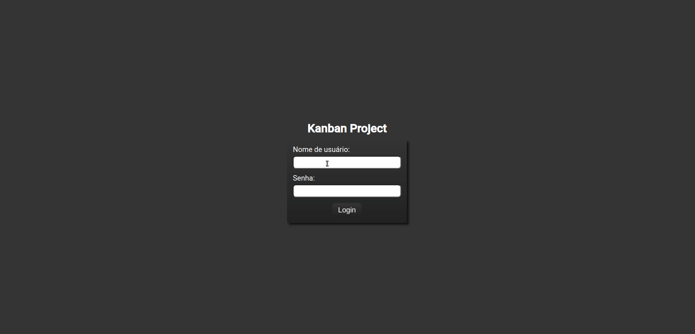

<h1 align="center">
    Kanban Project
</h1>


<p align="center">
 <a href="#📷-demonstração">Demonstração</a> •
 <a href="#ℹ️-sobre">Sobre</a> • 
 <a href="#🚀-como-executar">Como executar</a> •  
 <a href="#🛠-tecnologias">Tecnologias</a> • 
 <a href="#📚-aprendizado">Aprendizado</a> • 
 <a href="#👨‍💻-autor">Autor</a> • 
 <a href="#👏-agradecimentos">Agradecimentos</a> 
</p>
<p align="center">

<a href="https://www.linkedin.com/in/rodrigovitoriense/">

</a>


</p><br>

# 📷 Demonstração


<br><br>

# ℹ️ Sobre

Esta é uma solução para um quadro de Kanban. Para a construção do projeto foram observados os seguintes requisitos:

- Uma API deve ser usada para persistência dos cards (ela trabalha com persistência em memória) e não deve ser alterada (pasta backend).

- A interface gráfica serão 2 telas:

  - A tela do quadro de kanban: deve haver três colunas chamadas "To do", "Doing" e "Done".

  - A tela de login: formulário para inserção de login e senha.

- A tela do quadro de Kanban só deve ser acessada caso o exista um token no localStorage. Caso não exista, o usuário deve ser redirecionado para uma página de erro.

- Os cards devem ser listados nessas colunas de acordo com o valor do campo lista presenta no card. Os valores de lista devem ser "ToDo", "Doing" e "Done", respectivamente.

- Deve haver um local que permita criar um card passando valores para o titulo e conteudo, deve haver um botão para adicionar o card.

- Um novo card deve sempre cair na lista "To Do" após persistido na API.

- O card deverá ter dois modos: Visualização e Edição.

  <br><br>

# 🚀 Como executar

Clone o projeto e acesse a pasta.

```
$ git clone https://github.com/rodrigorvix/lets-code/

```

Executar front-end:

```
$ cd lets-code/kanban-project/frontend/
# Install the dependencies
$ npm install

# Start the project
$ ng server
```
O aplicativo front-end estará disponível para acesso pelo seu navegador em http://localhost:4200
<br>

Executar back-end:

```
$ cd lets-code/kanban-project/backend/
# Install the dependencies
$ npm install

# Start the project
$ npm run server
```
O aplicativo front-end estará disponível para acesso pelo seu navegador em http://localhost:5000

Credencias de teste: <br>
  login: letscode <br>
  senha: lets@123
 <br>

# 🛠 Tecnologias

As seguintes tecnologias foram utilizadas na construção do projeto:

- [Angular](https://angular.io/)
- [SASS](https://sass-lang.com/)
- [TypeScript](https://www.typescriptlang.org/)

  <br><br>

# 📚 Aprendizado

Neste projeto, tive como principais aprendizados a utilização dos seguintes recursos do framework Angular:

- Componentes
- Databinding
- Diretivas
- Formulários
- Rotas
- Services e injeção de dependência
- Observables
- Requisições HTTP
- Autenticação e proteção de rotas
- NgModules
  <br><br>

# 👨‍💻 Autor

- [Linkedin](https://www.linkedin.com/in/rodrigovitoriense/)
- [GitHub](https://github.com/rodrigorvix)
  <br><br>

# 👏 Agradecimentos

Agradeço aos excelentes professores da Let's Code (https://letscode.com.br/) por compartilhar o conhecimento necessário para a realização do projeto. 
